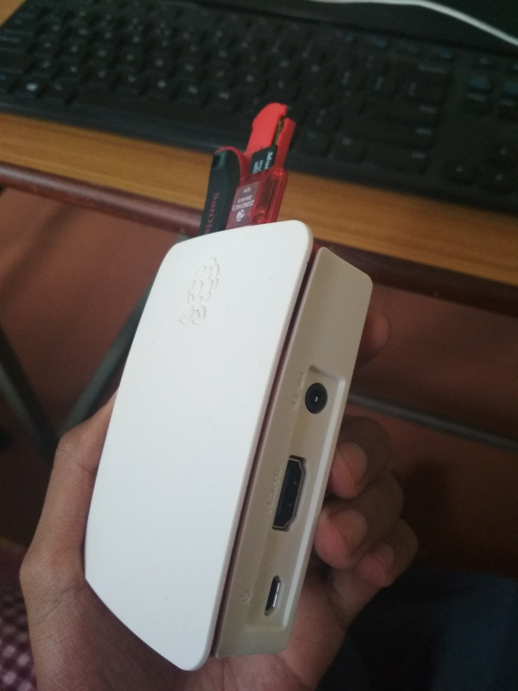
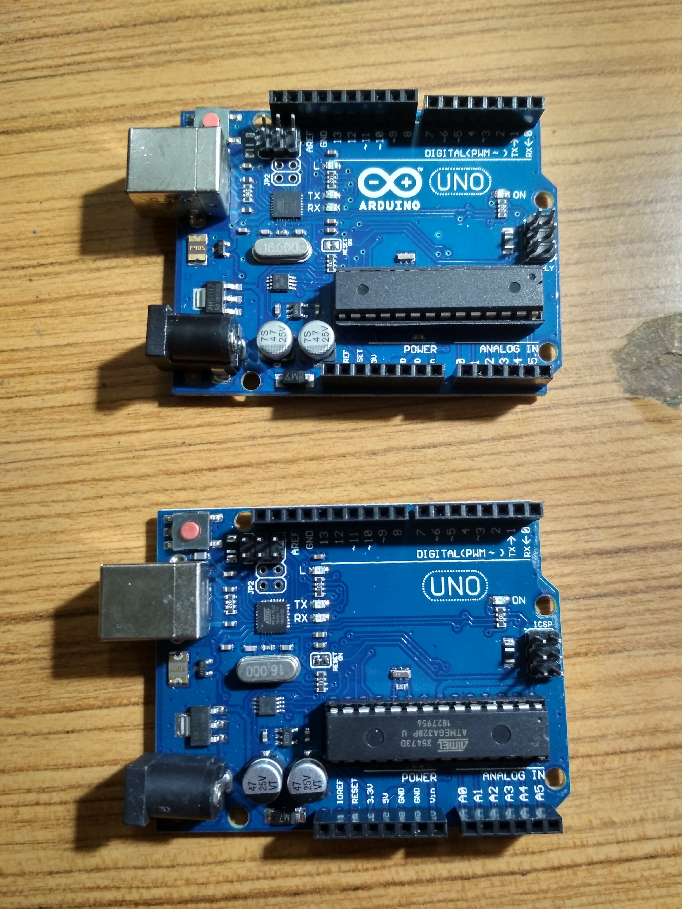
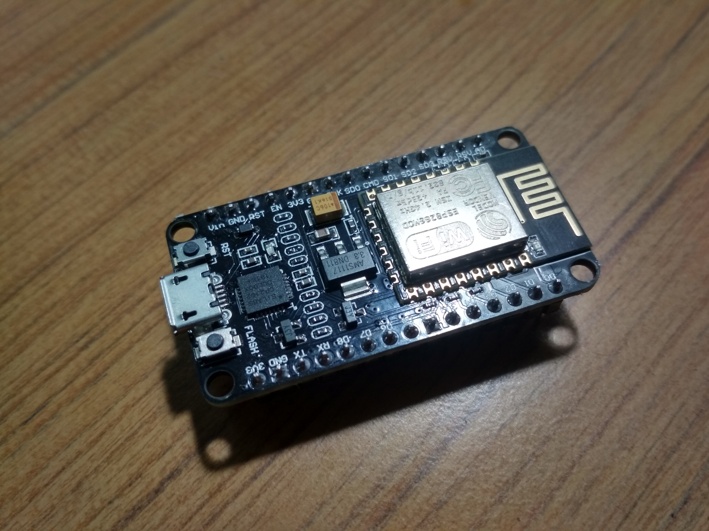

# UNMANNED VEHICLES.

## Some of the acronyms used.
- ARE - Algebraic Ricatti equation
- AUV - Autonomous underwater vehicles
- BDF - Backward differentiation formula
- DRE - Differential Riccati equation
- GNC - Guidance, navigation, and control
- HJB - Hamilton–Jacobi–Bellman
- ISR - Intelligence, surveillance, and reconnaissance
- LIP - Lock-in-place
- LL - Leaderless
- LMI - Linear matrix inequality
- LOE - Loss of effectiveness
- LQR - Linear quadratic regulator
- MIMO - Multi-input multi-output
- MLF - Modified leader–follower
- NBS - Nash bargaining solution
- ND - Negative definite
- NSD - Negative semi-definite
- NUMS - Network of unmanned systems
- PDE - Partial differential equation
- PD - Positive definite
- PFF - Precision formation flight
- PSD - Positive semi-definite
- SN - Sensor networks
- UAVs - Unmanned aerial vehicles
- UGVs - Unmanned ground vehicles
- UUVs - Unmanned underwater vehicles

# **Basic TOOLS required for implementation and visualization**
* networkx python module
* matplotlib
* numpy
* algorithms and data structures

# Concepts that I would and may use to **develop** this system include:
- Operating System Concepts.
- IPC (Interprocess Communications).
- Socket Programming
- Multipoint client-server programming.
- OpenCV (Computer Vision)
- Robotics and few electronic and circuit boards.

# Hardware that I would be using include
* Raspberry Pi 3b+
* DELL Latitude-D630
* DELL Inspiron 15
* MI Android Phone
* Aruduino Uno Boards (2 boards)
* NodeMCU
* ESP8266 separate board
* Bluetooth

# **IMAGES**

### Raspberry Pi 3b+

### Arduino UNO Boards

### NodeMCU

# Let's set up the environment required for this code and research
# [SETUP ENVIRONMENT ...(0_0)](pages/env-setup/envsetup.md)
